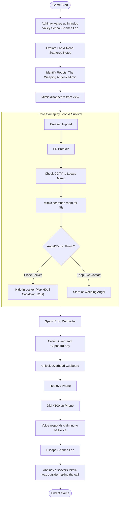

```mermaid
flowchart TD
    Start([Game Start]) --> WakeUp[Abhinav wakes up in Indus Valley School Science Lab]
    
    WakeUp --> ExploreLab[Explore Lab & Read Scattered Notes]
    ExploreLab --> IntroRobots[Identify Robots: The Weeping Angel & Mimic]
    
    IntroRobots --> MimicDisappears[Mimic disappears from view]
    MimicDisappears --> MainLoop

    subgraph MainLoop ["Core Gameplay Loop & Survival"]
        direction TB
        Breaker[Breaker Tripped] --> FixBreaker[Fix Breaker]
        FixBreaker --> CCTV[Check CCTV to Locate Mimic]
        CCTV --> MimicSearch[Mimic searches room for 45s]
        
        MimicSearch --> Defense{Angel/Mimic Threat?}
        Defense -- Close Locker --> LockerMechanism["Hide in Locker (Max 60s | Cooldown 120s)"]
        Defense -- Keep Eye Contact --> AngelMech[Stare at Weeping Angel]
    end

    MainLoop --> Objective1[Spam 'E' on Wardrobe]
    Objective1 --> GetKey[Collect Overhead Cupboard Key]
    
    GetKey --> UnlockCupboard[Unlock Overhead Cupboard]
    UnlockCupboard --> GetPhone[Retrieve Phone]
    
    GetPhone --> CallPolice[Dial #100 on Phone]
    CallPolice --> VoiceResponse[Voice responds claiming to be Police]
    
    VoiceResponse --> EscapeLab[Escape Science Lab]
    
    EscapeLab --> Twist[Abhinav discovers Mimic was outside making the call]
    
    Twist --> End([End of Game])
```
